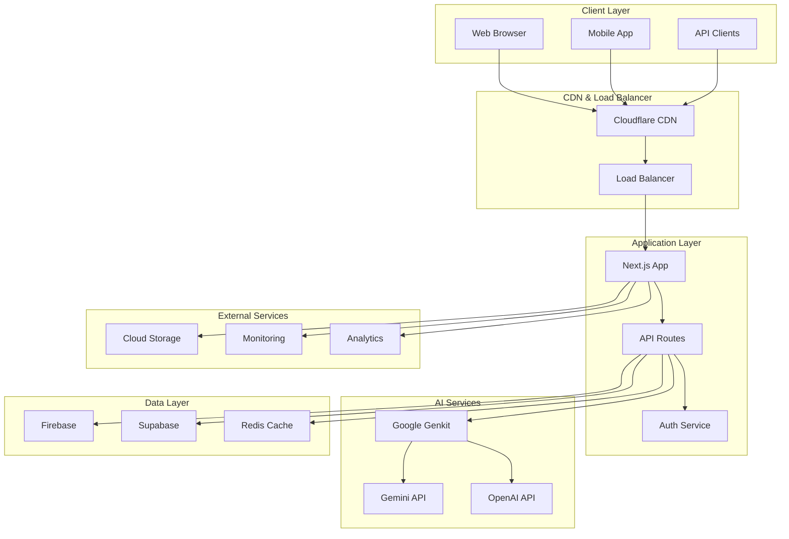

# Sparks Technical Architecture Documentation

## Table of Contents
1. [System Architecture Overview](#system-architecture-overview)
2. [Frontend Architecture](#frontend-architecture)
3. [Backend Architecture](#backend-architecture)
4. [Database Design](#database-design)
5. [API Specifications](#api-specifications)
6. [Component Creation Guide](#component-creation-guide)
7. [Security Architecture](#security-architecture)
8. [Performance & Scalability](#performance--scalability)
9. [Deployment Architecture](#deployment-architecture)
10. [Development Guidelines](#development-guidelines)

---

## System Architecture Overview

### High-Level Architecture



### Technology Stack

#### Frontend Stack
- **Framework:** Next.js 14 with App Router
- **Language:** TypeScript 5.0+
- **Styling:** Tailwind CSS 3.0+
- **UI Components:** Custom components + shadcn/ui
- **State Management:** React Context + Zustand
- **Form Handling:** React Hook Form + Zod validation
- **HTTP Client:** Fetch API with custom wrappers

#### Backend Stack
- **Runtime:** Node.js 18+
- **Framework:** Next.js API Routes
- **AI Integration:** Google Genkit
- **Authentication:** Firebase Auth / Supabase Auth
- **Database:** Firebase Firestore / Supabase PostgreSQL
- **Caching:** Redis
- **File Storage:** Firebase Storage / Supabase Storage

#### Infrastructure
- **Hosting:** Vercel
- **CDN:** Cloudflare
- **Monitoring:** Vercel Analytics + Custom monitoring
- **Error Tracking:** Sentry
- **CI/CD:** GitHub Actions

---

## Frontend Architecture

### Project Structure

```
src/
├── app/                          # Next.js App Router
│   ├── (main)/                   # Main application routes
│   │   ├── community/            # Community features
│   │   ├── playground/           # AI Prompt Playground
│   │   ├── tools/               # AI Tools Dock
│   │   ├── workflows/           # Workflow Management
│   │   ├── docs/                # Documentation
│   │   ├── status/              # System Status
│   │   ├── support/             # Support Center
│   │   └── layout.tsx           # Main layout
│   ├── login/                   # Authentication pages
│   ├── api/                     # API routes
│   ├── globals.css              # Global styles
│   └── layout.tsx               # Root layout
├── components/                   # Reusable components
│   ├── ui/                      # Base UI components
│   ├── shared/                  # Shared components
│   ├── forms/                   # Form components
│   └── layouts/                 # Layout components
├── lib/                         # Utility libraries
│   ├── utils.ts                 # General utilities
│   ├── auth.ts                  # Authentication utilities
│   ├── db.ts                    # Database utilities
│   ├── ai.ts                    # AI service utilities
│   └── validations.ts           # Zod schemas
├── hooks/                       # Custom React hooks
├── stores/                      # State management
├── types/                       # TypeScript type definitions
└── constants/                   # Application constants
```

### Component Architecture

#### Component Hierarchy
```
App
├── RootLayout
│   ├── AuthProvider
│   ├── ThemeProvider
│   └── ToastProvider
└── MainLayout
    ├── Sidebar
    ├── Header
    ├── MainContent
    │   ├── PageHeader
    │   ├── PageContent
    │   └── PageFooter
    └── Footer
```

#### Component Design Patterns

**1. Compound Components**
```typescript
// Card compound component
const Card = ({ children, className, ...props }: CardProps) => {
  return (
    <div className={cn("card-base", className)} {...props}>
      {children}
    </div>
  )
}

const CardHeader = ({ children, className, ...props }: CardHeaderProps) => {
  return (
    <div className={cn("card-header", className)} {...props}>
      {children}
    </div>
  )
}

Card.Header = CardHeader
Card.Content = CardContent
Card.Footer = CardFooter

export { Card }
```

**2. Render Props Pattern**
```typescript
interface DataFetcherProps<T> {
  url: string
  children: (data: T | null, loading: boolean, error: Error | null) => React.ReactNode
}

function DataFetcher<T>({ url, children }: DataFetcherProps<T>) {
  const [data, setData] = useState<T | null>(null)
  const [loading, setLoading] = useState(true)
  const [error, setError] = useState<Error | null>(null)

  useEffect(() => {
    fetchData(url)
      .then(setData)
      .catch(setError)
      .finally(() => setLoading(false))
  }, [url])

  return <>{children(data, loading, error)}</>
}
```

**3. Custom Hooks Pattern**
```typescript
// usePrompt hook
export function usePrompt() {
  const [prompts, setPrompts] = useState<Prompt[]>([])
  const [loading, setLoading] = useState(false)
  const [error, setError] = useState<string | null>(null)

  const createPrompt = useCallback(async (promptData: CreatePromptData) => {
    setLoading(true)
    try {
      const newPrompt = await api.prompts.create(promptData)
      setPrompts(prev => [...prev, newPrompt])
      return newPrompt
    } catch (err) {
      setError(err.message)
      throw err
    } finally {
      setLoading(false)
    }
  }, [])

  const updatePrompt = useCallback(async (id: string, updates: Partial<Prompt>) => {
    // Implementation
  }, [])

  const deletePrompt = useCallback(async (id: string) => {
    // Implementation
  }, [])

  return {
    prompts,
    loading,
    error,
    createPrompt,
    updatePrompt,
    deletePrompt
  }
}
```

### State Management Architecture

#### Global State with Zustand
```typescript
// stores/auth.ts
interface AuthState {
  user: User | null
  loading: boolean
  error: string | null
  signIn: (email: string, password: string) => Promise<void>
  signOut: () => Promise<void>
  updateProfile: (updates: Partial<User>) => Promise<void>
}

export const useAuthStore = create<AuthState>((set, get) => ({
  user: null,
  loading: false,
  error: null,
  
  signIn: async (email, password) => {
    set({ loading: true, error: null })
    try {
      const user = await authService.signIn(email, password)
      set({ user, loading: false })
    } catch (error) {
      set({ error: error.message, loading: false })
    }
  },
  
  signOut: async () => {
    await authService.signOut()
    set({ user: null })
  },
  
  updateProfile: async (updates) => {
    const { user } = get()
    if (!user) return
    
    const updatedUser = await authService.updateProfile(user.id, updates)
    set({ user: updatedUser })
  }
}))
```

#### Local State with React Context
```typescript
// contexts/playground.tsx
interface PlaygroundContextType {
  currentPrompt: string
  setCurrentPrompt: (prompt: string) => void
  parameters: AIParameters
  setParameters: (params: AIParameters) => void
  history: PromptHistory[]
  addToHistory: (entry: PromptHistory) => void
}

const PlaygroundContext = createContext<PlaygroundContextType | undefined>(undefined)

export function PlaygroundProvider({ children }: { children: React.ReactNode }) {
  const [currentPrompt, setCurrentPrompt] = useState('')
  const [parameters, setParameters] = useState<AIParameters>(defaultParameters)
  const [history, setHistory] = useState<PromptHistory[]>([])

  const addToHistory = useCallback((entry: PromptHistory) => {
    setHistory(prev => [entry, ...prev.slice(0, 49)]) // Keep last 50
  }, [])

  return (
    <PlaygroundContext.Provider value={{
      currentPrompt,
      setCurrentPrompt,
      parameters,
      setParameters,
      history,
      addToHistory
    }}>
      {children}
    </PlaygroundContext.Provider>
  )
}
```

---

## Backend Architecture

### API Route Structure

```
src/app/api/
├── auth/                        # Authentication endpoints
│   ├── login/route.ts
│   ├── logout/route.ts
│   ├── register/route.ts
│   └── profile/route.ts
├── prompts/                     # Prompt management
│   ├── route.ts                 # GET, POST /api/prompts
│   ├── [id]/route.ts           # GET, PUT, DELETE /api/prompts/[id]
│   ├── [id]/test/route.ts      # POST /api/prompts/[id]/test
│   └── templates/route.ts       # GET /api/prompts/templates
├── ai/                         # AI service endpoints
│   ├── generate/route.ts       # POST /api/ai/generate
│   ├── models/route.ts         # GET /api/ai/models
│   └── usage/route.ts          # GET /api/ai/usage
├── tools/                      # AI Tools endpoints
│   ├── route.ts                # GET, POST /api/tools
│   ├── [id]/route.ts          # GET, PUT, DELETE /api/tools/[id]
│   └── [id]/execute/route.ts   # POST /api/tools/[id]/execute
├── workflows/                  # Workflow management
│   ├── route.ts               # GET, POST /api/workflows
│   ├── [id]/route.ts         # GET, PUT, DELETE /api/workflows/[id]
│   └── [id]/execute/route.ts  # POST /api/workflows/[id]/execute
├── community/                  # Community features
│   ├── posts/route.ts         # GET, POST /api/community/posts
│   ├── posts/[id]/route.ts    # GET, PUT, DELETE /api/community/posts/[id]
│   └── users/[id]/route.ts    # GET /api/community/users/[id]
└── admin/                     # Admin endpoints
    ├── users/route.ts
    ├── analytics/route.ts
    └── system/route.ts
```

### API Design Patterns

#### RESTful API Structure
```typescript
// app/api/prompts/route.ts
import { NextRequest, NextResponse } from 'next/server'
import { auth } from '@/lib/auth'
import { db } from '@/lib/db'
import { promptSchema } from '@/lib/validations'

// GET /api/prompts
export async function GET(request: NextRequest) {
  try {
    const user = await auth.getUser(request)
    if (!user) {
      return NextResponse.json({ error: 'Unauthorized' }, { status: 401 })
    }

    const { searchParams } = new URL(request.url)
    const page = parseInt(searchParams.get('page') || '1')
    const limit = parseInt(searchParams.get('limit') || '20')
    const category = searchParams.get('category')
    const tags = searchParams.get('tags')?.split(',')

    const prompts = await db.prompts.findMany({
      where: {
        userId: user.id,
        ...(category && { category }),
        ...(tags && { tags: { hasSome: tags } })
      },
      skip: (page - 1) * limit,
      take: limit,
      orderBy: { updatedAt: 'desc' }
    })

    const total = await db.prompts.count({
      where: { userId: user.id }
    })

    return NextResponse.json({
      data: prompts,
      pagination: {
        page,
        limit,
        total,
        pages: Math.ceil(total / limit)
      }
    })
  } catch (error) {
    console.error('Error fetching prompts:', error)
    return NextResponse.json(
      { error: 'Internal server error' },
      { status: 500 }
    )
  }
}

// POST /api/prompts
export async function POST(request: NextRequest) {
  try {
    const user = await auth.getUser(request)
    if (!user) {
      return NextResponse.json({ error: 'Unauthorized' }, { status: 401 })
    }

    const body = await request.json()
    const validatedData = promptSchema.parse(body)

    const prompt = await db.prompts.create({
      data: {
        ...validatedData,
        userId: user.id,
        createdAt: new Date(),
        updatedAt: new Date()
      }
    })

    return NextResponse.json(prompt, { status: 201 })
  } catch (error) {
    if (error instanceof z.ZodError) {
      return NextResponse.json(
        { error: 'Validation error', details: error.errors },
        { status: 400 }
      )
    }

    console.error('Error creating prompt:', error)
    return NextResponse.json(
      { error: 'Internal server error' },
      { status: 500 }
    )
  }
}
```

#### Middleware Pattern
```typescript
// lib/middleware/auth.ts
export function withAuth(handler: (req: NextRequest, user: User) => Promise<NextResponse>) {
  return async (request: NextRequest) => {
    try {
      const user = await auth.getUser(request)
      if (!user) {
        return NextResponse.json({ error: 'Unauthorized' }, { status: 401 })
      }
      return handler(request, user)
    } catch (error) {
      return NextResponse.json({ error: 'Authentication failed' }, { status: 401 })
    }
  }
}

// lib/middleware/validation.ts
export function withValidation<T>(schema: z.ZodSchema<T>) {
  return function (handler: (req: NextRequest, data: T) => Promise<NextResponse>) {
    return async (request: NextRequest) => {
      try {
        const body = await request.json()
        const validatedData = schema.parse(body)
        return handler(request, validatedData)
      } catch (error) {
        if (error instanceof z.ZodError) {
          return NextResponse.json(
            { error: 'Validation error', details: error.errors },
            { status: 400 }
          )
        }
        throw error
      }
    }
  }
}

// Usage
export const POST = withAuth(
  withValidation(promptSchema)(
    async (request, user, data) => {
      // Handler implementation
    }
  )
)
```

### AI Service Integration

#### Genkit Configuration
```typescript
// lib/ai/genkit.ts
import { genkit } from '@genkit-ai/core'
import { googleAI } from '@genkit-ai/googleai'
import { firebase } from '@genkit-ai/firebase'

export const ai = genkit({
  plugins: [
    googleAI({
      apiKey: process.env.GEMINI_API_KEY,
    }),
    firebase({
      projectId: process.env.FIREBASE_PROJECT_ID,
    })
  ],
  model: 'gemini-1.5-pro',
  config: {
    temperature: 0.7,
    maxOutputTokens: 2048,
    topP: 0.9,
    topK: 40
  }
})

// AI prompt flow
export const generatePromptResponse = ai.defineFlow(
  {
    name: 'generatePromptResponse',
    inputSchema: z.object({
      prompt: z.string(),
      model: z.string().optional(),
      parameters: z.object({
        temperature: z.number().min(0).max(2).optional(),
        maxTokens: z.number().min(1).max(4096).optional(),
        topP: z.number().min(0).max(1).optional()
      }).optional()
    }),
    outputSchema: z.object({
      response: z.string(),
      usage: z.object({
        inputTokens: z.number(),
        outputTokens: z.number(),
        totalTokens: z.number()
      }),
      metadata: z.object({
        model: z.string(),
        executionTime: z.number(),
        timestamp: z.string()
      })
    })
  },
  async ({ prompt, model = 'gemini-1.5-pro', parameters = {} }) => {
    const startTime = Date.now()
    
    const result = await ai.generate({
      model,
      prompt,
      config: {
        temperature: parameters.temperature ?? 0.7,
        maxOutputTokens: parameters.maxTokens ?? 2048,
        topP: parameters.topP ?? 0.9
      }
    })

    const executionTime = Date.now() - startTime

    return {
      response: result.text(),
      usage: {
        inputTokens: result.usage?.inputTokens || 0,
        outputTokens: result.usage?.outputTokens || 0,
        totalTokens: result.usage?.totalTokens || 0
      },
      metadata: {
        model,
        executionTime,
        timestamp: new Date().toISOString()
      }
    }
  }
)
```

---

## Database Design

### Firebase Firestore Schema

#### Collections Structure
```typescript
// types/database.ts
interface User {
  id: string
  email: string
  displayName: string
  avatar?: string
  preferences: {
    defaultModel: string
    theme: 'light' | 'dark' | 'system'
    notifications: {
      email: boolean
      push: boolean
      community: boolean
    }
  }
  subscription: {
    plan: 'free' | 'pro' | 'enterprise'
    status: 'active' | 'cancelled' | 'expired'
    expiresAt?: Date
  }
  usage: {
    tokensUsed: number
    promptsCreated: number
    toolsUsed: number
  }
  createdAt: Date
  updatedAt: Date
}

interface Prompt {
  id: string
  userId: string
  title: string
  content: string
  description?: string
  category: string
  tags: string[]
  isPublic: boolean
  isTemplate: boolean
  version: number
  parameters: {
    model: string
    temperature: number
    maxTokens: number
    topP: number
  }
  performance: {
    averageRating: number
    totalRuns: number
    successRate: number
    averageResponseTime: number
  }
  metadata: {
    language: string
    complexity: 'beginner' | 'intermediate' | 'advanced'
    estimatedTokens: number
  }
  createdAt: Date
  updatedAt: Date
}

interface Tool {
  id: string
  userId: string
  name: string
  description: string
  category: string
  icon: string
  isPublic: boolean
  configuration: {
    inputFields: ToolInputField[]
    outputFormat: string
    promptTemplate: string
    parameters: AIParameters
  }
  usage: {
    totalRuns: number
    averageRating: number
    lastUsed: Date
  }
  createdAt: Date
  updatedAt: Date
}

interface Workflow {
  id: string
  userId: string
  name: string
  description: string
  category: string
  isPublic: boolean
  nodes: WorkflowNode[]
  edges: WorkflowEdge[]
  configuration: {
    timeout: number
    retryPolicy: {
      maxRetries: number
      backoffStrategy: 'linear' | 'exponential'
    }
    errorHandling: 'stop' | 'continue' | 'retry'
  }
  statistics: {
    totalRuns: number
    successRate: number
    averageExecutionTime: number
  }
  createdAt: Date
  updatedAt: Date
}
```

#### Firestore Security Rules
```javascript
// firestore.rules
rules_version = '2';
service cloud.firestore {
  match /databases/{database}/documents {
    // Users can read/write their own data
    match /users/{userId} {
      allow read, write: if request.auth != null && request.auth.uid == userId;
    }
    
    // Prompts access control
    match /prompts/{promptId} {
      allow read: if request.auth != null && (
        resource.data.userId == request.auth.uid ||
        resource.data.isPublic == true
      );
      allow write: if request.auth != null && 
        resource.data.userId == request.auth.uid;
      allow create: if request.auth != null && 
        request.resource.data.userId == request.auth.uid;
    }
    
    // Tools access control
    match /tools/{toolId} {
      allow read: if request.auth != null && (
        resource.data.userId == request.auth.uid ||
        resource.data.isPublic == true
      );
      allow write: if request.auth != null && 
        resource.data.userId == request.auth.uid;
      allow create: if request.auth != null && 
        request.resource.data.userId == request.auth.uid;
    }
    
    // Community posts
    match /community/{postId} {
      allow read: if request.auth != null;
      allow write: if request.auth != null && 
        resource.data.authorId == request.auth.uid;
      allow create: if request.auth != null && 
        request.resource.data.authorId == request.auth.uid;
    }
  }
}
```

### Supabase PostgreSQL Schema

```sql
-- Users table
CREATE TABLE users (
  id UUID PRIMARY KEY DEFAULT gen_random_uuid(),
  email VARCHAR(255) UNIQUE NOT NULL,
  display_name VARCHAR(100),
  avatar_url TEXT,
  preferences JSONB DEFAULT '{}',
  subscription JSONB DEFAULT '{"plan": "free", "status": "active"}',
  usage JSONB DEFAULT '{"tokensUsed": 0, "promptsCreated": 0, "toolsUsed": 0}',
  created_at TIMESTAMP WITH TIME ZONE DEFAULT NOW(),
  updated_at TIMESTAMP WITH TIME ZONE DEFAULT NOW()
);

-- Prompts table
CREATE TABLE prompts (
  id UUID PRIMARY KEY DEFAULT gen_random_uuid(),
  user_id UUID REFERENCES users(id) ON DELETE CASCADE,
  title VARCHAR(255) NOT NULL,
  content TEXT NOT NULL,
  description TEXT,
  category VARCHAR(100),
  tags TEXT[] DEFAULT '{}',
  is_public BOOLEAN DEFAULT FALSE,
  is_template BOOLEAN DEFAULT FALSE,
  version INTEGER DEFAULT 1,
  parameters JSONB DEFAULT '{}',
  performance JSONB DEFAULT '{}',
  metadata JSONB DEFAULT '{}',
  created_at TIMESTAMP WITH TIME ZONE DEFAULT NOW(),
  updated_at TIMESTAMP WITH TIME ZONE DEFAULT NOW()
);

-- Tools table
CREATE TABLE tools (
  id UUID PRIMARY KEY DEFAULT gen_random_uuid(),
  user_id UUID REFERENCES users(id) ON DELETE CASCADE,
  name VARCHAR(255) NOT NULL,
  description TEXT,
  category VARCHAR(100),
  icon VARCHAR(100),
  is_public BOOLEAN DEFAULT FALSE,
  configuration JSONB DEFAULT '{}',
  usage JSONB DEFAULT '{}',
  created_at TIMESTAMP WITH TIME ZONE DEFAULT NOW(),
  updated_at TIMESTAMP WITH TIME ZONE DEFAULT NOW()
);

-- Workflows table
CREATE TABLE workflows (
  id UUID PRIMARY KEY DEFAULT gen_random_uuid(),
  user_id UUID REFERENCES users(id) ON DELETE CASCADE,
  name VARCHAR(255) NOT NULL,
  description TEXT,
  category VARCHAR(100),
  is_public BOOLEAN DEFAULT FALSE,
  nodes JSONB DEFAULT '[]',
  edges JSONB DEFAULT '[]',
  configuration JSONB DEFAULT '{}',
  statistics JSONB DEFAULT '{}',
  created_at TIMESTAMP WITH TIME ZONE DEFAULT NOW(),
  updated_at TIMESTAMP WITH TIME ZONE DEFAULT NOW()
);

-- Community posts table
CREATE TABLE community_posts (
  id UUID PRIMARY KEY DEFAULT gen_random_uuid(),
  author_id UUID REFERENCES users(id) ON DELETE CASCADE,
  title VARCHAR(255) NOT NULL,
  content TEXT NOT NULL,
  category VARCHAR(100),
  tags TEXT[] DEFAULT '{}',
  likes_count INTEGER DEFAULT 0,
  comments_count INTEGER DEFAULT 0,
  is_featured BOOLEAN DEFAULT FALSE,
  created_at TIMESTAMP WITH TIME ZONE DEFAULT NOW(),
  updated_at TIMESTAMP WITH TIME ZONE DEFAULT NOW()
);

-- Indexes for performance
CREATE INDEX idx_prompts_user_id ON prompts(user_id);
CREATE INDEX idx_prompts_category ON prompts(category);
CREATE INDEX idx_prompts_tags ON prompts USING GIN(tags);
CREATE INDEX idx_prompts_public ON prompts(is_public) WHERE is_public = TRUE;

CREATE INDEX idx_tools_user_id ON tools(user_id);
CREATE INDEX idx_tools_category ON tools(category);
CREATE INDEX idx_tools_public ON tools(is_public) WHERE is_public = TRUE;

CREATE INDEX idx_workflows_user_id ON workflows(user_id);
CREATE INDEX idx_community_posts_author ON community_posts(author_id);
CREATE INDEX idx_community_posts_category ON community_posts(category);

-- Row Level Security (RLS)
ALTER TABLE users ENABLE ROW LEVEL SECURITY;
ALTER TABLE prompts ENABLE ROW LEVEL SECURITY;
ALTER TABLE tools ENABLE ROW LEVEL SECURITY;
ALTER TABLE workflows ENABLE ROW LEVEL SECURITY;
ALTER TABLE community_posts ENABLE ROW LEVEL SECURITY;

-- RLS Policies
CREATE POLICY "Users can view own profile" ON users
  FOR SELECT USING (auth.uid() = id);

CREATE POLICY "Users can update own profile" ON users
  FOR UPDATE USING (auth.uid() = id);

CREATE POLICY "Users can view own prompts or public prompts" ON prompts
  FOR SELECT USING (auth.uid() = user_id OR is_public = TRUE);

CREATE POLICY "Users can manage own prompts" ON prompts
  FOR ALL USING (auth.uid() = user_id);
```

---

## API Specifications

### Authentication API

#### POST /api/auth/login
**Request:**
```typescript
interface LoginRequest {
  email: string
  password: string
  rememberMe?: boolean
}
```

**Response:**
```typescript
interface LoginResponse {
  user: {
    id: string
    email: string
    displayName: string
    avatar?: string
  }
  token: string
  expiresAt: string
}
```

#### POST /api/auth/register
**Request:**
```typescript
interface RegisterRequest {
  email: string
  password: string
  displayName: string
  acceptTerms: boolean
}
```

### Prompts API

#### GET /api/prompts
**Query Parameters:**
- `page`: number (default: 1)
- `limit`: number (default: 20, max: 100)
- `category`: string
- `tags`: string (comma-separated)
- `search`: string
- `sort`: 'created' | 'updated' | 'rating' | 'usage'
- `order`: 'asc' | 'desc'

**Response:**
```typescript
interface PromptsResponse {
  data: Prompt[]
  pagination: {
    page: number
    limit: number
    total: number
    pages: number
  }
  filters: {
    categories: string[]
    tags: string[]
  }
}
```

#### POST /api/prompts
**Request:**
```typescript
interface CreatePromptRequest {
  title: string
  content: string
  description?: string
  category: string
  tags: string[]
  isPublic: boolean
  parameters: {
    model: string
    temperature: number
    maxTokens: number
    topP: number
  }
}
```

#### POST /api/prompts/[id]/test
**Request:**
```typescript
interface TestPromptRequest {
  input?: Record<string, any>
  parameters?: {
    model?: string
    temperature?: number
    maxTokens?: number
    topP?: number
  }
}
```

**Response:**
```typescript
interface TestPromptResponse {
  response: string
  usage: {
    inputTokens: number
    outputTokens: number
    totalTokens: number
    cost: number
  }
  metadata: {
    model: string
    executionTime: number
    timestamp: string
  }
}
```

### AI Tools API

#### GET /api/tools
**Response:**
```typescript
interface ToolsResponse {
  data: Tool[]
  categories: {
    name: string
    count: number
  }[]
}
```

#### POST /api/tools/[id]/execute
**Request:**
```typescript
interface ExecuteToolRequest {
  inputs: Record<string, any>
  options?: {
    async?: boolean
    webhook?: string
  }
}
```

**Response:**
```typescript
interface ExecuteToolResponse {
  result: any
  executionId: string
  status: 'completed' | 'running' | 'failed'
  usage: {
    tokensUsed: number
    executionTime: number
    cost: number
  }
}
```

### Workflows API

#### POST /api/workflows/[id]/execute
**Request:**
```typescript
interface ExecuteWorkflowRequest {
  inputs: Record<string, any>
  options?: {
    async?: boolean
    webhook?: string
    timeout?: number
  }
}
```

**Response:**
```typescript
interface ExecuteWorkflowResponse {
  executionId: string
  status: 'running' | 'completed' | 'failed'
  results?: Record<string, any>
  progress?: {
    completed: number
    total: number
    currentStep: string
  }
  usage: {
    totalTokens: number
    executionTime: number
    cost: number
  }
}
```

---

## Component Creation Guide

### UI Component Standards

#### Base Component Template
```typescript
// components/ui/button.tsx
import * as React from 'react'
import { Slot } from '@radix-ui/react-slot'
import { cva, type VariantProps } from 'class-variance-authority'
import { cn } from '@/lib/utils'

const buttonVariants = cva(
  'inline-flex items-center justify-center whitespace-nowrap rounded-md text-sm font-medium transition-colors focus-visible:outline-none focus-visible:ring-1 focus-visible:ring-ring disabled:pointer-events-none disabled:opacity-50',
  {
    variants: {
      variant: {
        default: 'bg-primary text-primary-foreground shadow hover:bg-primary/90',
        destructive: 'bg-destructive text-destructive-foreground shadow-sm hover:bg-destructive/90',
        outline: 'border border-input bg-background shadow-sm hover:bg-accent hover:text-accent-foreground',
        secondary: 'bg-secondary text-secondary-foreground shadow-sm hover:bg-secondary/80',
        ghost: 'hover:bg-accent hover:text-accent-foreground',
        link: 'text-primary underline-offset-4 hover:underline'
      },
      size: {
        default: 'h-9 px-4 py-2',
        sm: 'h-8 rounded-md px-3 text-xs',
        lg: 'h-10 rounded-md px-8',
        icon: 'h-9 w-9'
      }
    },
    defaultVariants: {
      variant: 'default',
      size: 'default'
    }
  }
)

export interface ButtonProps
  extends React.ButtonHTMLAttributes<HTMLButtonElement>,
    VariantProps<typeof buttonVariants> {
  asChild?: boolean
}

const Button = React.forwardRef<HTMLButtonElement, ButtonProps>(
  ({ className, variant, size, asChild = false, ...props }, ref) => {
    const Comp = asChild ? Slot : 'button'
    return (
      <Comp
        className={cn(buttonVariants({ variant, size, className }))}
        ref={ref}
        {...props}
      />
    )
  }
)
Button.displayName = 'Button'

export { Button, buttonVariants }
```

#### Form Component Pattern
```typescript
// components/forms/prompt-form.tsx
import { useForm } from 'react-hook-form'
import { zodResolver } from '@hookform/resolvers/zod'
import { z } from 'zod'
import { Button } from '@/components/ui/button'
import { Input } from '@/components/ui/input'
import { Textarea } from '@/components/ui/textarea'
import { Select } from '@/components/ui/select'
import { Form, FormControl, FormField, FormItem, FormLabel, FormMessage } from '@/components/ui/form'

const promptFormSchema = z.object({
  title: z.string().min(1, 'Title is required').max(100, 'Title too long'),
  content: z.string().min(10, 'Content must be at least 10 characters'),
  category: z.string().min(1, 'Category is required'),
  tags: z.array(z.string()).max(10, 'Maximum 10 tags allowed'),
  isPublic: z.boolean().default(false)
})

type PromptFormData = z.infer<typeof promptFormSchema>

interface PromptFormProps {
  initialData?: Partial<PromptFormData>
  onSubmit: (data: PromptFormData) => Promise<void>
  isLoading?: boolean
}

export function PromptForm({ initialData, onSubmit, isLoading }: PromptFormProps) {
  const form = useForm<PromptFormData>({
    resolver: zodResolver(promptFormSchema),
    defaultValues: {
      title: '',
      content: '',
      category: '',
      tags: [],
      isPublic: false,
      ...initialData
    }
  })

  const handleSubmit = async (data: PromptFormData) => {
    try {
      await onSubmit(data)
      form.reset()
    } catch (error) {
      // Error handling is done in parent component
    }
  }

  return (
    <Form {...form}>
      <form onSubmit={form.handleSubmit(handleSubmit)} className="space-y-6">
        <FormField
          control={form.control}
          name="title"
          render={({ field }) => (
            <FormItem>
              <FormLabel>Title</FormLabel>
              <FormControl>
                <Input placeholder="Enter prompt title" {...field} />
              </FormControl>
              <FormMessage />
            </FormItem>
          )}
        />
        
        <FormField
          control={form.control}
          name="content"
          render={({ field }) => (
            <FormItem>
              <FormLabel>Content</FormLabel>
              <FormControl>
                <Textarea 
                  placeholder="Enter your prompt content"
                  className="min-h-[200px]"
                  {...field}
                />
              </FormControl>
              <FormMessage />
            </FormItem>
          )}
        />
        
        {/* Additional form fields */}
        
        <div className="flex justify-end space-x-4">
          <Button type="button" variant="outline" onClick={() => form.reset()}>
            Reset
          </Button>
          <Button type="submit" disabled={isLoading}>
            {isLoading ? 'Saving...' : 'Save Prompt'}
          </Button>
        </div>
      </form>
    </Form>
  )
}
```

#### Feature Component Pattern
```typescript
// components/features/prompt-playground.tsx
import { useState, useCallback } from 'react'
import { Card, CardContent, CardHeader, CardTitle } from '@/components/ui/card'
import { Button } from '@/components/ui/button'
import { Textarea } from '@/components/ui/textarea'
import { Select } from '@/components/ui/select'
import { Slider } from '@/components/ui/slider'
import { usePrompt } from '@/hooks/use-prompt'
import { useAI } from '@/hooks/use-ai'

interface PromptPlaygroundProps {
  initialPrompt?: string
  onSave?: (prompt: string, response: string) => void
}

export function PromptPlayground({ initialPrompt = '', onSave }: PromptPlaygroundProps) {
  const [prompt, setPrompt] = useState(initialPrompt)
  const [response, setResponse] = useState('')
  const [parameters, setParameters] = useState({
    model: 'gemini-1.5-pro',
    temperature: 0.7,
    maxTokens: 2048
  })
  
  const { testPrompt, isLoading } = useAI()
  
  const handleTest = useCallback(async () => {
    if (!prompt.trim()) return
    
    try {
      const result = await testPrompt({
        prompt,
        parameters
      })
      setResponse(result.response)
    } catch (error) {
      console.error('Error testing prompt:', error)
    }
  }, [prompt, parameters, testPrompt])
  
  const handleSave = useCallback(() => {
    if (onSave && prompt && response) {
      onSave(prompt, response)
    }
  }, [onSave, prompt, response])
  
  return (
    <div className="grid grid-cols-1 lg:grid-cols-2 gap-6">
      {/* Prompt Input */}
      <Card>
        <CardHeader>
          <CardTitle>Prompt Input</CardTitle>
        </CardHeader>
        <CardContent className="space-y-4">
          <Textarea
            value={prompt}
            onChange={(e) => setPrompt(e.target.value)}
            placeholder="Enter your prompt here..."
            className="min-h-[300px]"
          />
          
          {/* Parameters */}
          <div className="space-y-4">
            <div>
              <label className="text-sm font-medium">Model</label>
              <Select
                value={parameters.model}
                onValueChange={(value) => setParameters(prev => ({ ...prev, model: value }))}
              >
                <option value="gemini-1.5-pro">Gemini 1.5 Pro</option>
                <option value="gemini-1.5-flash">Gemini 1.5 Flash</option>
              </Select>
            </div>
            
            <div>
              <label className="text-sm font-medium">Temperature: {parameters.temperature}</label>
              <Slider
                value={[parameters.temperature]}
                onValueChange={([value]) => setParameters(prev => ({ ...prev, temperature: value }))}
                min={0}
                max={2}
                step={0.1}
                className="mt-2"
              />
            </div>
            
            <div>
              <label className="text-sm font-medium">Max Tokens: {parameters.maxTokens}</label>
              <Slider
                value={[parameters.maxTokens]}
                onValueChange={([value]) => setParameters(prev => ({ ...prev, maxTokens: value }))}
                min={100}
                max={4096}
                step={100}
                className="mt-2"
              />
            </div>
          </div>
          
          <div className="flex space-x-2">
            <Button onClick={handleTest} disabled={isLoading || !prompt.trim()}>
              {isLoading ? 'Testing...' : 'Test Prompt'}
            </Button>
            <Button variant="outline" onClick={() => setPrompt('')}>
              Clear
            </Button>
          </div>
        </CardContent>
      </Card>
      
      {/* Response Output */}
      <Card>
        <CardHeader>
          <CardTitle>AI Response</CardTitle>
        </CardHeader>
        <CardContent>
          <div className="min-h-[300px] p-4 bg-muted rounded-md">
            {response ? (
              <pre className="whitespace-pre-wrap text-sm">{response}</pre>
            ) : (
              <p className="text-muted-foreground">AI response will appear here...</p>
            )}
          </div>
          
          {response && (
            <div className="mt-4 flex justify-end">
              <Button onClick={handleSave}>
                Save Result
              </Button>
            </div>
          )}
        </CardContent>
      </Card>
    </div>
  )
}
```

### Component Testing

#### Unit Test Template
```typescript
// __tests__/components/ui/button.test.tsx
import { render, screen, fireEvent } from '@testing-library/react'
import { Button } from '@/components/ui/button'

describe('Button Component', () => {
  it('renders with default props', () => {
    render(<Button>Click me</Button>)
    const button = screen.getByRole('button', { name: /click me/i })
    expect(button).toBeInTheDocument()
    expect(button).toHaveClass('bg-primary')
  })
  
  it('applies variant classes correctly', () => {
    render(<Button variant="outline">Outline Button</Button>)
    const button = screen.getByRole('button')
    expect(button).toHaveClass('border')
  })
  
  it('handles click events', () => {
    const handleClick = jest.fn()
    render(<Button onClick={handleClick}>Click me</Button>)
    
    fireEvent.click(screen.getByRole('button'))
    expect(handleClick).toHaveBeenCalledTimes(1)
  })
  
  it('is disabled when disabled prop is true', () => {
    render(<Button disabled>Disabled Button</Button>)
    const button = screen.getByRole('button')
    expect(button).toBeDisabled()
    expect(button).toHaveClass('disabled:opacity-50')
  })
})
```

---

**Document Version:** 1.0  
**Last Updated:** December 2024  
**Review Cycle:** Monthly  
**Owner:** Engineering Team